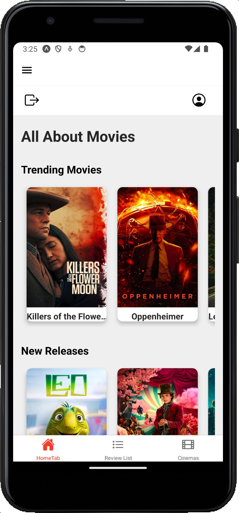

# All About Movies

A mobile application built using React Native, focusing on movie-related functionalities such as viewing movie details, writing and reading reviews, and finding nearby cinemas.

## Technologies Used

- React Native for cross-platform mobile app development.
- Firebase for authentication, database, and storage.
- Additional libraries and APIs for enhanced features.

## Setup Instructions

1. Clone the repository: `git clone [repository URL]`.
2. Navigate to the project directory: `cd [project directory]`.
3. Install dependencies: `npm install`.
4. Run the project: `npx expo start --clear`.

## Features

- **Authentication:** User sign-up and login functionality.
- **Camera Use:** Integration with the device's camera for profile picture updates.
- **Location Tracking:** Displaying nearby cinemas based on user location.
- **Notifications:** Setting up and managing movie-related notifications.
- **External API Integration:** Fetching movie details, reviews, and cinema information.

## Screenshots

## Demo Video

Check out the demo video of our app: [Demo Video of the App](https://drive.google.com/file/d/1JUBh5uMczazAyrcy-9nq0DB9PbpnirJF/view?usp=sharing)

## Contributions

- **Yinan Tang (christine8828):** Implemented authentication and camera functionality.
- **Chen-Fei Chu (ozzyfly):** Worked on location tracking and external API integration.

## Iterations

### Iteration 1

Developed core functionalities and established the project structure:

- **Firestore Collections Setup:**

  - `Movies`: Stores movie details like title, genre, release date, etc.
  - `Reviews`: Stores user reviews with fields such as movieId, userId, rating.
  - `Users`: Manages user profiles including username, email, favorite movies.

- **Navigation Setup:**
  - Implemented `BottomTabNavigator`, `DrawerNavigator`, and `StackNavigator` for intuitive navigation within the app.

### Iteration 2

Focused on adding and refining features:

- **Enhanced Authentication:** Implemented user login and sign-up using Firebase Authentication.
- **Camera Integration:** Enabled users to update their profile pictures using the device's camera.
- **Location-Based Features:** Introduced features for finding nearby cinemas using Google Maps API.
- **Notifications:** Set up a system for users to receive movie-related notifications using Expo Notifications.

### Iteration 3

In this iteration, the following functionalities were added or refined:

- **Authentication:** Improved stability and user experience for authentication processes.
- **Camera Use:** Enhanced the camera functionality for better image handling and uploading to Firebase Storage.
- **Location Tracking:** Fine-tuned the location-based features for more accurate and efficient cinema discovery.
- **Notifications:** Expanded the notification system for more interactive and timely reminders.
- **External API Integration:** Integrated additional endpoints from TMDB API for fetching detailed movie information.
